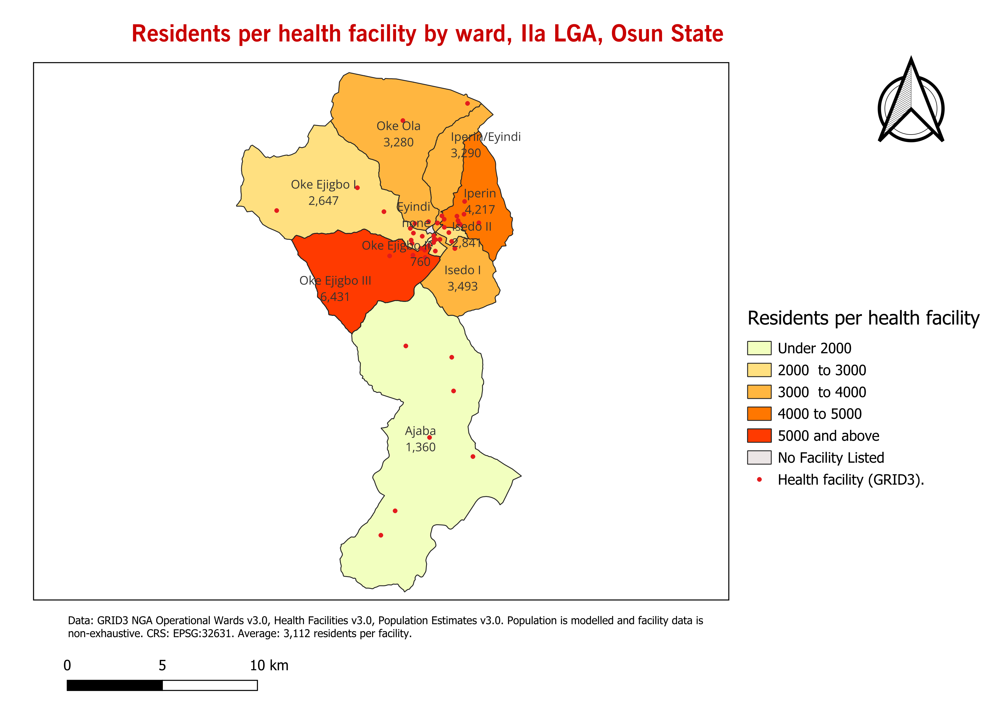

# Health facility distribution and population load in Ila LGA, Osun State

## The question

How many health facilities does each ward in Ila Local Government Area, Osun State contain, and how many residents does a single facility have to cover in each of those wards?

## The result

Across the eleven wards of Ila LGA, GRID3 lists **48 health facilities serving a modelled population of 149,378 people**, an average of about 3,100 residents per facility. The load is very uneven.

- **Oke Ejigbo III** carries the heaviest load, about 6,400 residents per facility.
- **Oke Ejigbo II** carries the lightest, about 760, more than eight times lower.
- **Eyindi** has no facility listed for a modelled population of about 2,100.
- Five of the eleven wards sit above the LGA average of 3,112 residents per facility.

A facility count on its own misleads. Oke Ejigbo I has the most facilities of any ward, nine, and a below-average load, while Oke Ejigbo III has four facilities and 17 percent of the LGA's population.



Facility data is non-exhaustive by GRID3's own description, and population is modelled rather than counted. Read a ward with no facility as unverified rather than unserved. Full limitations are in the [Week 4 analysis](week-4-analysis.md).

## Why it is worth doing

Ila is a largely rural local government of about 303 square kilometres, run from Ila Orangun and split into eleven wards. Provision tends to gather around the headquarters town, leaving outlying wards thinner without anyone having planned it that way.

A facility count on its own hides this. Dividing ward population across the facilities present converts the count into a measure of load, which shows where the strain falls. The Ila local government health department and the Osun State Primary Health Care Development Board both have to choose where new primary health centres go and which existing ones need staffing first.

## Where to find each week

| Week | What it contains | File |
|---|---|---|
| 1 | Project brief, with a source link for every dataset | [project-brief.md](project-brief.md) |
| 2 | Data notes describing everything downloaded | [data-notes.md](data-notes.md) |
| 3 | Prepared data and the five quality checks | [week-3-data-preparation.md](week-3-data-preparation.md) |
| 4 | Analysis, results by ward, and limitations | [week-4-analysis.md](week-4-analysis.md) |
| 4 | Map image | [maps/ila-facility-load.png](maps/ila-facility-load.png) |
| 4 | Month 1 summary | [month-1-summary.md](month-1-summary.md) |

## Study area

Ila Local Government Area, Osun State, Nigeria. Headquarters at Ila Orangun. Eleven wards, defined by the GRID3 Operational Wards v3.0 boundaries. All analysis is carried out in EPSG:32631, UTM zone 31N.

## Data

GRID3 is the primary data source for this project.

| Layer | Source | Type |
|---|---|---|
| Ward boundaries | GRID3 NGA Operational Wards v3.0 | polygon |
| LGA boundary | GRID3 NGA Operational LGA Boundaries | polygon, context only |
| Health facilities | GRID3 NGA Health Facilities v3.0 | point |
| Population estimates | GRID3 NGA Population Estimates v3.0 | raster |
| Roads | OpenStreetMap via QuickOSM | line |

## Repository structure

```
README.md
project-brief.md
data-notes.md
week-3-data-preparation.md
week-4-analysis.md
month-1-summary.md
maps/
  ila-facility-load.png
data/
  raw/           downloaded files, never edited
  processed/     clipped, reprojected and analysis-ready files
```

The analysis-ready GeoPackage is `data/processed/ila_analysis_ready.gpkg`.

## Attribution

GRID3 (Geo-Referenced Infrastructure and Demographic Data for Development). Operational Wards v3.0, Operational LGA Boundaries, Health Facilities v3.0, and NGA Population Estimates v3.0.

© OpenStreetMap contributors.

Built over twelve months with GeoDev Lab Africa, Cohort One.
